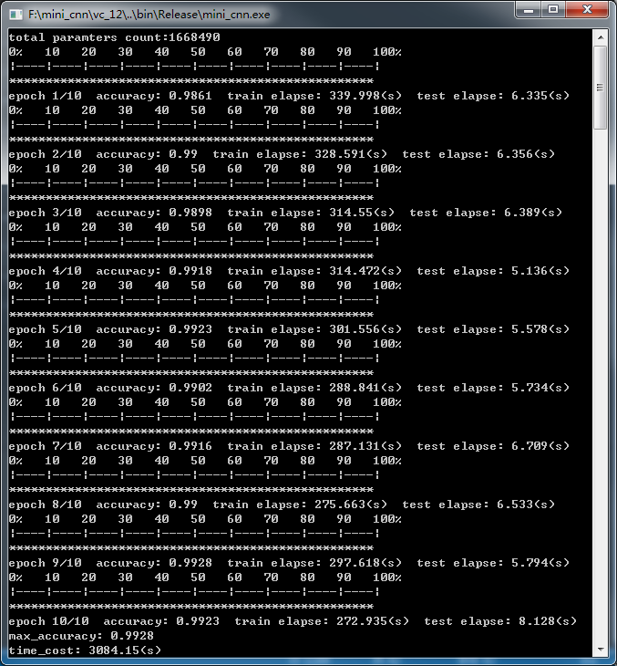

# **mini_cnn** is a light-weight convolutional neural network implementation based on c++11, mutli threading and head only


## Features</br>
- mutli threading
- gradient checking for all layer weights/bias
- weight initializer
	- xavier initialize
	- he initializer
- layer-types
	- fully connected layer
	- convolutional layer
	- activation layer
	- flatten layer
	- softmax loglikelihood output layer
	- sigmod cross entropy output layer
	- average pooling layer
	- max pooling layer
	- dropout layer
- activation functions
	- sigmoid
	- softmax
	- rectified linear(relu)
- loss functions
	- mean squared error
	- cross-entropy
	- loglikelihood
- optimization algorithms
	- stochastic gradient descent
- fast convolution(im2col + gemm)
### Todo list
	- fast convolution(winograd)
	- train on gpu
	- batch normalization
	- more optimization algorithms such as adagrad，momentum etc	
	- serilize/deserilize
## Examples</br>
train **mnist** dataset</br>

2-layer conv on mnist dataset</br>
```
	conv 3x3x32 relu
	   |
	maxpool 2x2
	   |
	conv 3x3x64 relu
	   |
	maxpool 2x2
	   |
	fc 1024
	   |
	log-likelihood softmax 10
```
```cpp
network create_cnn()
{
	network nn;
	nn.add_layer(new input_layer(W_input, H_input, D_input));
	nn.add_layer(new convolutional_layer(3, 3, 1, 32, 1, 1, padding_type::eValid, activation_type::eRelu));
	nn.add_layer(new max_pooling_layer(2, 2, 2, 2));
	nn.add_layer(new convolutional_layer(3, 3, 32, 64, 1, 1, padding_type::eValid, activation_type::eRelu));
	nn.add_layer(new max_pooling_layer(2, 2, 2, 2));
	nn.add_layer(new fully_connected_layer(1024, activation_type::eRelu));
	nn.add_layer(new output_layer(C_classCount, lossfunc_type::eSoftMax_LogLikelihood, activation_type::eSoftMax));
	return nn;
}
```
more details in [main.cpp](main.cpp)
## Result</br>


## References</br>
[1] [Neural Networks and Deep Learning](http://neuralnetworksanddeeplearning.com/) by By Michael Nielsen</br>
[2] [Deep Learning](http://www.deeplearningbook.org/), book by Ian Goodfellow, Yoshua Bengio, and Aaron Courville</br>
[3] http://cs231n.github.io/convolutional-networks </br>
[4] http://cs231n.stanford.edu/slides/2018/cs231n_2018_lecture05.pdf</br>
[5] http://ufldl.stanford.edu/tutorial/supervised/ConvolutionalNeuralNetwork/</br>
[6] http://deeplearning.net/software/theano_versions/dev/tutorial/conv_arithmetic.html#transposed-convolution-arithmetic</br>
[7] [Gradient checking](http://ufldl.stanford.edu/wiki/index.php/Gradient_checking_and_advanced_optimization)</br>
[8] [2D Max Pooling Backward Layer](https://software.intel.com/sites/products/documentation/doclib/daal/daal-user-and-reference-guides/daal_prog_guide/GUID-2C3AA967-AE6A-4162-84EB-93BE438E3A05.htm)</br>
[9] https://blog.csdn.net/mrhiuser/article/details/52672824

